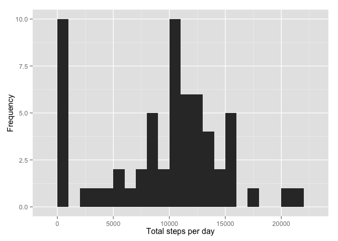
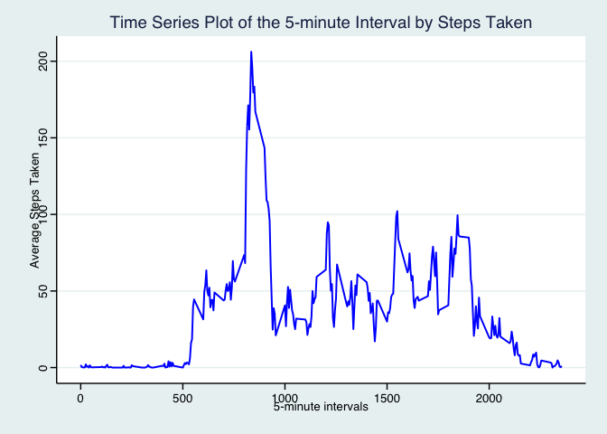
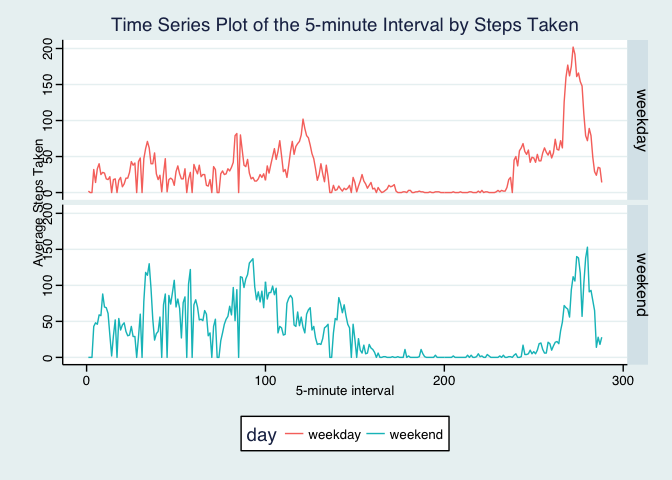

# Reproducible Research - Peer Assignment 1
John DeStefano  
August 15, 2015  


## Loading and preprocessing data
##### 1. Load the data (i.e. read.csv())

```r
if(!file.exists('activity.csv')){
    unzip('activity.zip')
}
stepData <- read.csv('activity.csv', colClasses = c("integer", "Date", "factor"))
```
##### 2. Process/transform the data into a format suitable for analysis

```r
stepData$month <- as.numeric(format(stepData$date, "%m"))
stepData$day <- as.POSIXlt(stepData$date)$wday
head(stepData)
```

```
##   steps       date interval month day
## 1    NA 2012-10-01        0    10   1
## 2    NA 2012-10-01        5    10   1
## 3    NA 2012-10-01       10    10   1
## 4    NA 2012-10-01       15    10   1
## 5    NA 2012-10-01       20    10   1
## 6    NA 2012-10-01       25    10   1
```

```r
dim(stepData)
```

```
## [1] 17568     5
```

-----

## What is mean total number of steps taken per day?
#### 1. Calculate the mean total number of steps per day

```r
stepsByDayNoNA <- tapply(stepData$steps, stepData$date, sum, na.rm=TRUE)
head(stepsByDayNoNA)
```

```
## 2012-10-01 2012-10-02 2012-10-03 2012-10-04 2012-10-05 2012-10-06 
##          0        126      11352      12116      13294      15420
```

```r
dim(stepsByDayNoNA)
```

```
## [1] 61
```

#### 2. Make a histogram of the total number of steps taken per day

```r
qplot(stepsByDayNoNA, xlab='Total steps per day', ylab='Frequency', binwidth=1000)
```

 

#### 3. Calculate and report the mean and median total number of steps taken per day

```r
stepsByDayMean <- format(round(mean(stepsByDayNoNA), 2), nsmall=2)
stepsByDayMedian <- median(stepsByDayNoNA)
```
* Mean: 9354.23
* Median:  10395

-----

## What is the average daily activity pattern?
#### 1. Make a time series plot (i.e. type = "l") of the 5-minute interval (x-axis) and the average number of steps taken, averaged across all days (y-axis)

```r
avgSteps <- aggregate(stepData$steps, list(interval = as.numeric(as.character(stepData$interval))), FUN = "mean", na.rm=TRUE)
names(avgSteps)[2] <- "mean"
head(avgSteps)
```

```
##   interval      mean
## 1        0 1.7169811
## 2        5 0.3396226
## 3       10 0.1320755
## 4       15 0.1509434
## 5       20 0.0754717
## 6       25 2.0943396
```

```r
dim(avgSteps)
```

```
## [1] 288   2
```

```r
ggplot(avgSteps, aes(interval, mean)) + geom_line(color = "blue", size = 0.7) + labs(title = "Time Series Plot of the 5-minute Interval by Steps Taken", x = "5-minute intervals", y = "Average Steps Taken") + theme_stata()
```

 

#### 2. Which 5-minute interval, on average across all the days in the dataset, contains the maximum number of steps?

```r
rec <- avgSteps[which.max(avgSteps$mean),]
recInterval <- rec$interval
recMean <- format(round(rec$mean, 2), nsmall=2)
```

* Mean max: 206.17
* Mean max interval: 835

----

## Imputing missing values
#### 1. Calculate and report the total number of missing values in the dataset (i.e. the total number of rows with NA)

```r
totalRowsMissingData <- sum(is.na(stepData))
```
* Total Rows in dataset with missing data: 2304


#### 2. Devise a strategy for filling in all of the missing values in the dataset. The strategy does not need to be sophisticated. For example, you could use the mean/median for that day, or the mean for that 5-minute interval, etc.

For this case I used the mean.

```r
meanByDateTbl <- aggregate(stepData$steps, list(date = as.Date(as.character(stepData$date))), FUN = "mean", na.rm=TRUE)
meanByDateTbl[is.na(meanByDateTbl)] <- 0
names(meanByDateTbl) <- c("date", "mean")
head(meanByDateTbl)
```

```
##         date     mean
## 1 2012-10-01  0.00000
## 2 2012-10-02  0.43750
## 3 2012-10-03 39.41667
## 4 2012-10-04 42.06944
## 5 2012-10-05 46.15972
## 6 2012-10-06 53.54167
```


#### 3. Create a new dataset that is equal to the original dataset but with the missing data filled in.

```r
newStepData <- read.csv('activity.csv', colClasses = c("integer", "Date", "factor"))
newStepData$date <- as.Date(newStepData$date, format="%Y%m%d")

# Starting errors
startErrNumb <- sum(is.na(newStepData))
for (i in 1:nrow(newStepData)) {
    if (is.na(newStepData$steps[i])) {
        dateKey <- newStepData$date[i]
        repl <- meanByDateTbl[meanByDateTbl$date == dateKey,]$mean
        newStepData$steps[i] <- repl
    }
}

# Could use impute also?
# newStepData <- read.csv('activity.csv', colClasses = c("integer", "Date", "factor"))
# newStepData$steps <- impute(newSteData$steps, FUN=mean)

head(newStepData)
```

```
##   steps       date interval
## 1     0 2012-10-01        0
## 2     0 2012-10-01        5
## 3     0 2012-10-01       10
## 4     0 2012-10-01       15
## 5     0 2012-10-01       20
## 6     0 2012-10-01       25
```

```r
endErrNumb <- sum(is.na(newStepData))
```

* Starting number rows with missing data: 2304
* Ending number rows with missing data: 0

#### 4. Make a histogram of the total number of steps taken each day and Calculate and report the mean and median total number of steps taken per day. Do these values differ from the estimates from the first part of the assignmet? What is the impact of imputing missing data on the estimates of the total daily number of steps?

```r
newStepDataByDay <- tapply(newStepData$steps, newStepData$date, sum, na.rm=TRUE)
head(newStepDataByDay)
```

```
## 2012-10-01 2012-10-02 2012-10-03 2012-10-04 2012-10-05 2012-10-06 
##          0        126      11352      12116      13294      15420
```

```r
qplot(newStepDataByDay, xlab='Total steps per day', ylab='Frequency', binwidth=1000)
```

 

```r
# Mean
newTotal <- aggregate(newStepData$steps, list(Date = newStepData$date), FUN = "sum")$x
newMean <- format(round(mean(newTotal), 2), nsmall=2)
oldTotal <- aggregate(stepData$steps, list(Date = stepData$date), FUN = "sum", na.rm=TRUE)$x
oldMean <- format(round(mean(oldTotal), 2), nsmall=2)

# Median
newMedian <- format(round(median(newTotal), 2), nsmall=2)
oldMedian <- format(round(median(oldTotal), 2), nsmall=2)
```

* Old Mean: 9354.23
* New Mean: 9354.23
* Old Median: 10395.00
* New Median: 10395.00

Conclusion: Given the above the data that was missing did not significantly effect the results.


----

## Are there differences in activity patterns between weekdays and weekends?
#### 1. Create a new factor variable in the dataset with two levels – “weekday” and “weekend” indicating whether a given date is a weekday or weekend day.

```r
newStepData$day <- ifelse(as.POSIXlt(newStepData$date)$wday %in% c(0,6), 'weekend', 'weekday')
newStepData$day <- as.factor(newStepData$day)
head(newStepData)
```

```
##   steps       date interval     day
## 1     0 2012-10-01        0 weekday
## 2     0 2012-10-01        5 weekday
## 3     0 2012-10-01       10 weekday
## 4     0 2012-10-01       15 weekday
## 5     0 2012-10-01       20 weekday
## 6     0 2012-10-01       25 weekday
```

#### 2. Make a panel plot containing a time series plot (i.e. type = "l") of the 5-minute interval (x-axis) and the average number of steps taken, averaged across all weekday days or weekend days (y-axis). See the README file in the GitHub repository to see an example of what this plot should look like using simulated data.

```r
meanNewStepData <- aggregate(newStepData$steps ~ newStepData$interval + newStepData$day, data = list(newStepData), FUN = "mean")
names(meanNewStepData) <- c("interval", "day", "steps")
meanNewStepData$day = as.factor(meanNewStepData$day)
head(meanNewStepData)
```

```
##   interval     day      steps
## 1        0 weekday  2.0222222
## 2       10 weekday  0.1555556
## 3      100 weekday  0.3777778
## 4     1000 weekday 32.4666667
## 5     1005 weekday 14.6222222
## 6     1010 weekday 33.4222222
```

```r
# graph
ggplot(meanNewStepData, aes(x=as.integer(interval), y=as.integer(steps), colour=day)) + geom_line() + labs(title = "Time Series Plot of the 5-minute Interval by Steps Taken", x = "5-minute interval", y = "Average Steps Taken") + theme_stata() + facet_grid(day ~ .)
```

 
